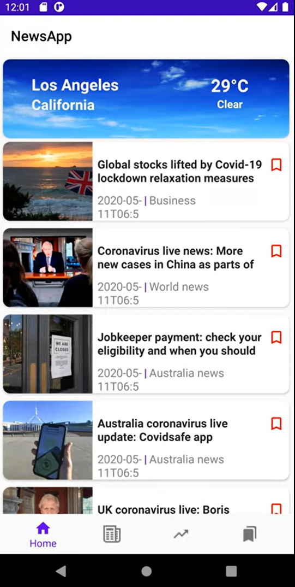
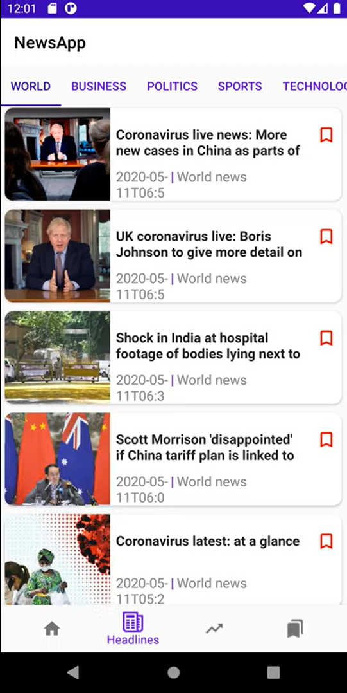
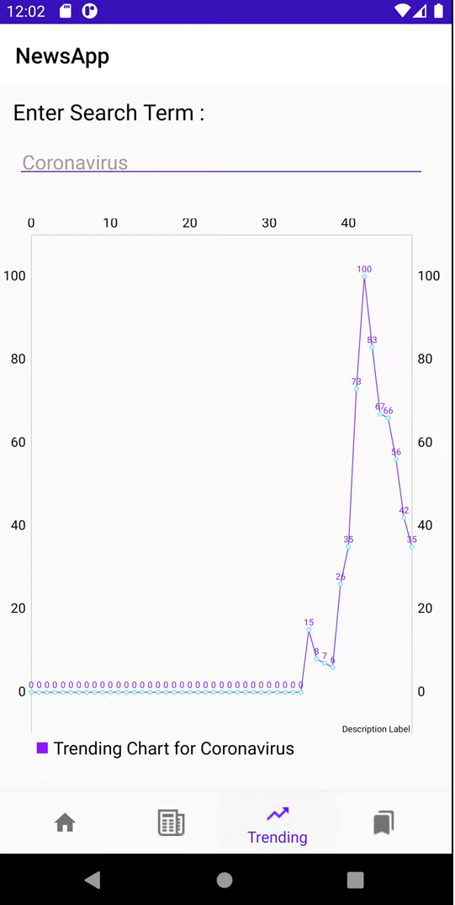
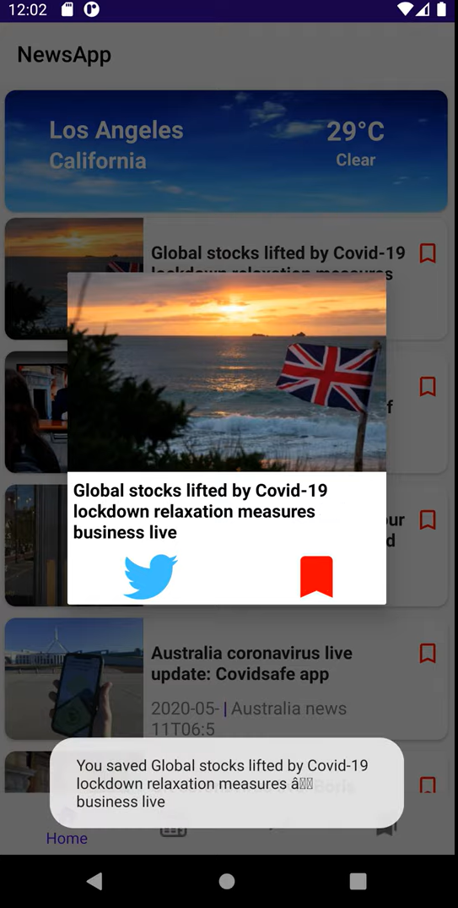

# Android-News-App
Youtube demo link: https://youtu.be/IaFrY6Trblc    
It is an Android Development project, which allows users to search for latest news, look at detailed information about them, bookmark those news and post on Twitter about them. 

- Environment: Android Studio
- Language: Java/JSON
- API: Guadian API/Google Trends API/Open Weather API
- Libraries: Picasso/Volley

 

